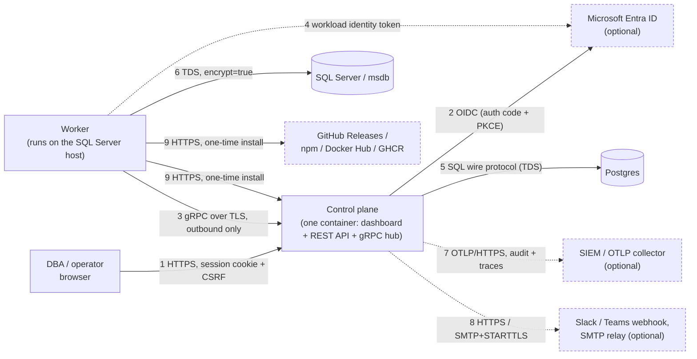

# Security architecture

What talks to what, over what protocol, and how each side proves who it is.
Written for a reviewer who needs to sign off on the deployment rather than
read the code — see [`security.md`](security.md) for the reasoning behind
each control and [`threat-model.md`](threat-model.md) for what's explicitly
in and out of scope. [`security-audit.md`](security-audit.md) is the record
of what's been tested and fixed.

## Component map

Solid arrows are required for the product to function; dashed components and
arrows are optional, deployment-dependent, or one-time (installation).
**Nothing in this diagram has a listening port on the SQL Server host** — the
worker only ever dials out. That property is load-bearing enough to have its
own line in `CLAUDE.md`: it's what makes the product deployable into a
segmented network where the SQL estate cannot be reached from outside.

## Connections, in detail

### 1. Browser ↔ control plane (dashboard + REST API)

| | |
|---|---|
| Protocol | HTTPS (HTTP in local development only) |
| Port | 8080 (behind whatever TLS-terminating proxy/load balancer fronts it — the optional bundled Caddy profile, or the operator's own) |
| Direction | Browser → control plane. Server-Sent Events (`/api/events`) is the one long-lived connection, still browser-initiated |
| Authentication | Session cookie (`rsagent_session`, `httpOnly`, `Secure` when `RSAGENT_PUBLIC_URL` is https, `SameSite=Lax`), issued at sign-in. Sign-in itself is local username/password (argon2id) or Entra ID OIDC — see connection 2 |
| Request integrity | Double-submit CSRF cookie (`rsagent_csrf`, readable by script on purpose) + `x-rsagent-csrf` header, checked on every mutating request server-side |
| Authorization | Every route declares a required permission; RBAC is base role (estate-wide) plus additive environment-scoped grants — see "Environment grants" in `security.md` |

### 2. Control plane ↔ Microsoft Entra ID (dashboard sign-in, optional)

| | |
|---|---|
| Protocol | HTTPS — OIDC authorization code flow with PKCE (S256) |
| Direction | Browser is redirected to Entra; Entra redirects back to the control plane's callback with a code; the control plane exchanges that code for tokens server-side |
| Authentication | The control plane authenticates to Entra as a registered application (client ID + client secret, or a certificate, depending on how the app registration is configured); the returned ID token's signature is verified against Entra's published JWKS |
| Authorization mapping | `roles` / `groups` claims from the validated token map to a Remote SQL Agent role via `RSAGENT_ENTRA_APP_ROLE_MAP`, captured at sign-in — see "Group membership is a snapshot" in `security.md` |
| Configured by | `RSAGENT_AUTH_MODE=entra\|both`, `RSAGENT_ENTRA_TENANT_ID`, `RSAGENT_ENTRA_CLIENT_ID`, `RSAGENT_ENTRA_CLIENT_SECRET` |

### 3. Worker ↔ control plane (the worker hub)

| | |
|---|---|
| Protocol | gRPC over TLS (protobuf-defined messages, `packages/protocol`) |
| Port | 8443 |
| Direction | **Worker dials the control plane. The control plane never opens a connection toward a worker or the SQL host it runs on.** This is what lets the SQL estate sit in a network segment the control plane cannot reach into |
| Transport encryption | TLS, required by default (`RSAGENT_GRPC_REQUIRE_TLS`, refuses to start in plaintext unless explicitly overridden — see the fail-open fix in `security-audit.md`) |
| Worker authentication (pick one, per worker) | **mtls** *(installer default)* — a client certificate issued by the control plane's own embedded CA (`packages/server/src/worker-auth/ca.ts`), verified by the gRPC server against that CA on every connection, and **renewed automatically at half its lifetime** over the authenticated session (`worker-auth/renewal.ts`, `packages/worker/src/cert-renewal.ts`). No PKI of your own and no rotation work. **entra** — an Azure managed identity token (workload identity), verified against Entra; no session credential stored on the SQL host at all. **token** — a bearer API key obtained once at enrolment, presented as call metadata; the weakest of the three, since anything that reads it — including a TLS-terminating proxy — can replay it from anywhere |
| Worker identity binding (mtls) | The certificate's **SHA-256 fingerprint**, recorded in `worker_credentials` at issuance. CN and SAN are set for legibility but are *not* evaluated at authentication, so host renames and DNS changes cannot break it, and the CSR's own subject is discarded so a worker cannot name itself into another worker's identity |
| Credential lifetime | mtls: `RSAGENT_WORKER_CERT_VALIDITY_DAYS` (default 90), self-renewing; a worker offline past expiry must be re-enrolled. token: `RSAGENT_WORKER_TOKEN_TTL_DAYS` (default none), rotated by an operator. entra: minutes, issued per connection by Azure |
| Command integrity | Every command the control plane sends is individually signed (`packages/protocol/src/signing.ts`, RSA-SHA256) and the worker verifies the signature before acting. The signing key arrives in the session handshake (`HelloAck`); pin its fingerprint in `worker.yaml` (`commandSigningKeyFingerprint`) to defend against a compromised TLS-terminating proxy substituting its own key — unpinned, the guarantee is weaker ("whoever sent `HelloAck` also signed this"), and the worker logs that fact once per session |
| Authorization ceiling | `maxCapability` in the worker's own `worker.yaml` (`readOnly`\|`operate`\|`schedule`\|`full`), enforced **locally by the worker** as the intersection with whatever the control plane grants. The control plane's side of that arithmetic is advisory only and cannot raise it — this is the property designed to survive a full control-plane compromise |

### 4. Worker ↔ Entra ID (workload identity, `entra` auth mode only)

| | |
|---|---|
| Protocol | HTTPS, Azure Instance Metadata Service / managed identity token endpoint |
| Direction | Worker → Entra, to obtain a short-lived access token presented to the control plane on connection 3 |
| Authentication | The worker's own Azure-assigned managed identity (system- or user-assigned, `clientId` pinned in `worker.yaml`); no long-lived secret is ever stored on the SQL host |

### 5. Control plane ↔ Postgres

| | |
|---|---|
| Protocol | Postgres wire protocol |
| Port | 5432, **not published** outside the deployment's internal network (`expose:`, not `ports:`, in `docker-compose.yml`) |
| Authentication | Username/password from `RSAGENT_DATABASE_URL`, provisioned by the operator |
| Data at rest | Job definitions are stored as searchable, **unencrypted** `jsonb` — a deliberate trade for cross-estate search, documented in `security.md`. Encryption at rest is delegated to the platform: encrypted volume/TDE plus encrypted backups are on the deployment checklist |

### 6. Worker ↔ SQL Server (msdb)

| | |
|---|---|
| Protocol | Tabular Data Stream (TDS), the native SQL Server wire protocol |
| Port | Whatever the target instance listens on (1433 by default; named instances resolve via SQL Browser or an explicit `HOST\INSTANCE`) |
| Direction | Worker → SQL Server. The worker runs *on* the SQL Server host, so this is typically a loopback or same-host connection, not a network hop |
| Authentication | Integrated auth (the Windows service account is the SQL principal — **the installer's default**, and the only mode with no credential stored anywhere) or SQL authentication (username + password, encrypted to the worker's own key before ever leaving the operator's browser — see below) |
| Transport encryption | `encrypt: true` set by the installer; `trustServerCertificate: true` by default (accepts the instance's own certificate without validating its chain — appropriate for same-host/loopback traffic, not a public network hop) |
| Privilege | Least-privilege by design: `SQLAgentReaderRole` plus a small set of explicit grants (`deploy/sql/worker-permissions.sql`). Never `sysadmin`. The one feature requiring elevated rights (`xp_readerrorlog`, needs `securityadmin`/`sysadmin`) is dropped rather than escalating the worker's login — see "SQL Server privileges" in `security.md` |

### 7. Control plane ↔ SIEM / OTLP collector (optional)

| | |
|---|---|
| Protocol | OTLP/HTTP — separate exporters for the audit log (`RSAGENT_AUDIT_OTLP_*`) and distributed traces (`RSAGENT_TRACE_OTLP_*`), each independently enabled |
| Direction | Control plane → collector, outbound, queued with retry |
| Authentication | Bearer/API-key headers via `RSAGENT_AUDIT_OTLP_HEADERS` / `RSAGENT_TRACE_OTLP_HEADERS` (or the standard `OTEL_EXPORTER_OTLP_*` env vars), opaque to the control plane itself |
| What crosses | Structured audit events and request/command spans — **never** step bodies, canonical job JSON, or passwords; see "Keep job definitions out of the audit log" in `security-audit.md` and the pino redaction paths in `security.md` |

### 8. Control plane ↔ notification channels (optional)

| | |
|---|---|
| Protocol | HTTPS (Slack/Teams incoming webhooks) or SMTP, with STARTTLS enforced whenever a credentialed channel is configured |
| Direction | Control plane → channel, on job/notification events or an operator-triggered test |
| Authentication | Webhook URL is the credential (Slack/Teams convention); SMTP uses whatever the relay requires. Secrets are never returned by the API, only a truncated `secretHint` |
| Egress containment | Redirects are refused; the link-local/metadata range (`169.254.0.0/16`, `fe80::/10`) is blocked so a malicious channel config can't turn the **Test** button into a cloud metadata oracle. RFC1918 addresses are deliberately allowed — this product runs inside the firewall and an internal relay is the normal case. See "A webhook is an outbound request" in `security.md` |

### 9. Worker installation (one-time, per host)

| | |
|---|---|
| Protocol | HTTPS |
| Direction | The SQL Server host fetches the installer (`/install.sh`, `/install.ps1`) and the worker package (`/downloads/...`) **from the control plane itself**, not the public internet — this is what makes the one-line install work on a segmented network: a SQL host can always reach the control plane on 8443/8080, and usually cannot reach GitHub. `npm install -g @remote-sql-agent/worker` (published via npm's OIDC trusted publishing — no static `NPM_TOKEN` in this repository) is the alternative path for a host that *can* reach the public internet. The control plane image itself is published to Docker Hub and GHCR the same way, for operators who prefer to pull the container directly rather than use the compose file |
| Integrity | The release pipeline (`release.yml`) fetches and checksum-verifies WinSW and the pinned Node runtime before packaging; released artifacts are attested (`actions/attest-build-provenance`) |
| Outcome | A single-use enrolment token (issued from the dashboard, one-hour TTL, bound to the target host name) authorizes the worker's first connection (connection 3) and its own key material — an RSA keypair for credential decryption, and either an API key, a client certificate, or nothing at all (Entra mode) for session auth — is generated **on the SQL host, by the installer/worker itself**, never issued by or transmitted from the control plane |

## The credential-encryption path (SQL passwords, when not using integrated auth)

Not a network connection on its own, but the flow that makes the "control
plane never holds a usable SQL credential" claim concrete enough to check:

1. **Worker enrolment** (connection 9): the worker generates an RSA keypair
   locally on the SQL host (`packages/worker/src/credential-key.ts`, written
   with `O_EXCL` to reject a symlinked or pre-existing path) and sends only
   the **public** key to the control plane.
2. **Operator configures a SQL credential** in the dashboard: the browser
   encrypts the password client-side, in-browser, with `crypto.subtle`
   (RSA-OAEP-SHA256) to that worker's public key. This requires an HTTPS
   context — on plain HTTP the field is disabled rather than silently
   sending plaintext.
3. **Control plane** (connection 1, inbound) receives and stores only the
   ciphertext (`worker_instance_configs.credential_ciphertext`) plus the key
   fingerprint it was encrypted to. It holds no private key and cannot open
   it.
4. **Control plane relays the ciphertext to the worker** over connection 3
   (already authenticated and encrypted). The worker decrypts it in memory
   with its own private key, uses it to open a SQL connection pool
   (connection 6), and never writes the plaintext to disk.

A compromise of the control plane alone — the component every network
segment can reach by design — does not yield a working SQL credential for
any instance. A compromise of a specific worker host yields that host's own
credential only, which is unavoidable (the worker has to be able to log in)
and is why integrated auth (no stored credential at all) is the installer's
default.

## Summary: authentication methods by actor

| Actor | Authenticates to | Method(s) |
|---|---|---|
| DBA / operator | Control plane (dashboard) | Local password (argon2id) or Entra ID OIDC |
| Control plane | Entra ID | OIDC client credentials (client secret or cert), as a registered app |
| Worker | Control plane (hub) | mTLS client certificate, control-plane-issued and self-renewing (default) **or** Entra managed-identity token **or** an API key (bearer token) |
| Worker | Entra ID | Azure managed identity (system- or user-assigned) |
| Worker | SQL Server | Integrated auth (host service account) **or** SQL auth (password, end-to-end encrypted from browser to worker) |
| Control plane | Postgres | Username/password (`RSAGENT_DATABASE_URL`) |
| Control plane | SIEM / notification channels | Bearer headers / webhook URL / SMTP credentials, all opaque to and never returned by the control plane |

## Reviewer checklist

Things worth confirming for a specific deployment, not just the product:

- [ ] `RSAGENT_GRPC_REQUIRE_TLS` is not overridden to allow plaintext, and a real certificate (not the dev self-signed one) is configured
- [ ] Worker auth mode is `entra` on Azure/Arc hosts and `mtls` elsewhere. `token` is a bearer secret and needs a reason; the control plane warns at startup if a real deployment is still using it
- [ ] `RSAGENT_WORKER_AUTH_MODES` lists only the modes actually in use. The hub accepts any listed mode from any worker, so a migration is not finished until the mode being migrated *away from* is removed
- [ ] mTLS workers are renewing: `worker.certificate.renewed` audit rows should appear at roughly half `RSAGENT_WORKER_CERT_VALIDITY_DAYS` per worker. A worker that goes quiet here will stop connecting at its expiry
- [ ] `commandSigningKeyFingerprint` is pinned in `worker.yaml` for any worker where the threat model includes a compromised TLS-terminating proxy
- [ ] `maxCapability` is set to the minimum each host actually needs (default `readOnly`)
- [ ] Postgres is on an encrypted volume with encrypted backups (job definitions are unencrypted `jsonb` by design — see connection 5)
- [ ] SQL credentials use integrated auth wherever the host supports it; SQL-auth passwords are the only credential class this architecture cannot avoid storing per-host
- [ ] `RSAGENT_TRUSTED_PROXY_HOPS` matches the actual number of reverse proxies in front of the HTTP port (wrong values forge `remoteAddress` on every audit row)
- [ ] Audit export (connection 7) is configured to a destination outside this deployment, per the deployment checklist in `security.md`
